# Praktikum4  semester2

```
nama : raja Heppyanto
Kelas: TI.22.A2
NIM  : 312210235
```
### 1. Pegawai Dengan Tunjangan Null


### 2. Pegawai yang gajinya bukan 2.000.0000 dan 1.250.000

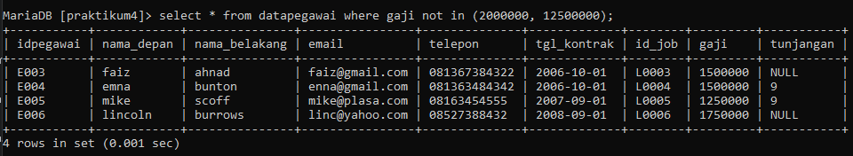

### 3. Pegawai yang tunjangannya not null

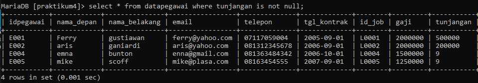

### 4. Tampilkan,hitung jumlah baris record tabel pegawai

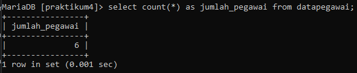

### 5. Hitung jumlah total gaji di kolom gaji

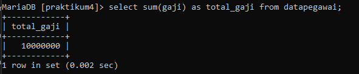

### 6. Hitung rata  rata gaji pegawai

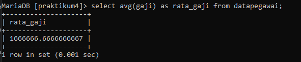

### 7. Tampilkan gaji terkecil

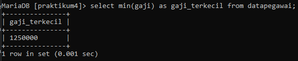

### 8. Tampilkan gaji terbesar

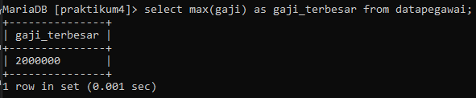

# TABEL FAUNA

### 1. jumlah hewan yang dimiliki setiap owner


### 2. jumlah hewan berdasarkan spesies

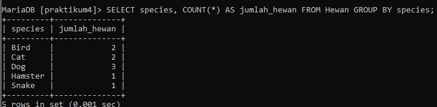

### 3. Jumlah hewan berdasarkan jenis kelamin

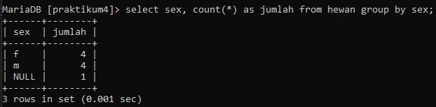

### 4. Jumlah hewan berdasarkan spesies dan jenis kelamin 

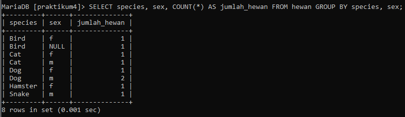

### 5.  jumlah hewan berdasarkan spesies 
(dog & cat) dan jenis kelamin 

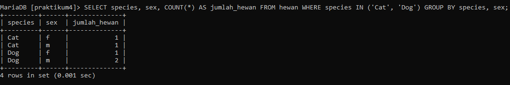

### 6. Tampilkan jumlah hewan berdasarkan jenis kelamin yang diketahui saja 

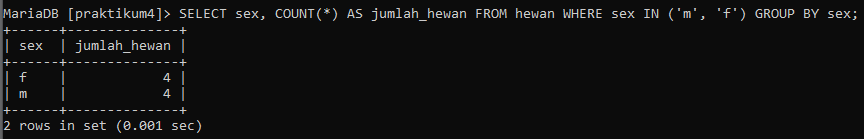

----------------------------------------------------------------------------------
# Thank You
