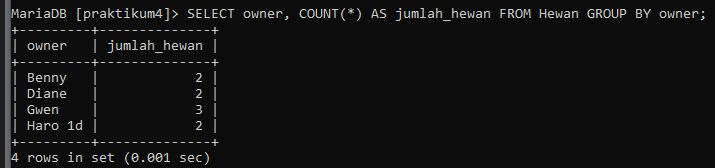

# Praktikum4  semester2

```
nama : raja Heppyanto
Kelas: TI.22.A2
NIM  : 312210235
```
### 1. Pegawai Dengan Tunjangan Null


### 2. Pegawai yang gajinya bukan 2.000.0000 dan 1.250.000


### 3. Pegawai yang tunjangannya not null


### 4. Tampilkan,hitung jumlah baris record tabel pegawai


### 5. Hitung jumlah total gaji di kolom gaji


### 6. Hitung rata  rata gaji pegawai


### 7. Tampilkan gaji terkecil


### 8. Tampilkan gaji terbesar


# TABEL FAUNA

### 1. jumlah hewan yang dimiliki setiap owner



### 2. jumlah hewan berdasarkan spesies


### 3. Jumlah hewan berdasarkan jenis kelamin


### 4. Jumlah hewan berdasarkan spesies dan jenis kelamin 


### 5.  jumlah hewan berdasarkan spesies 
(dog & cat) dan jenis kelamin 


### 6. Tampilkan jumlah hewan berdasarkan jenis kelamin yang diketahui saja 


----------------------------------------------------------------------------------
# Thank You
